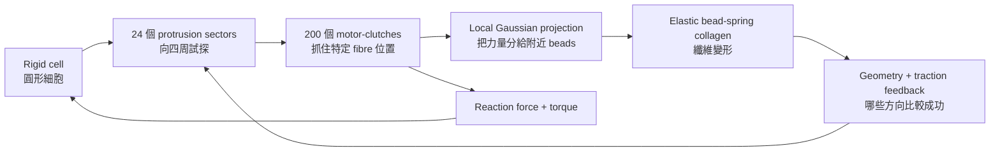

# G3 Motor-Clutch-Collagen 模型說明

> **一句話先說：**G3 把 G2 裡「先指定細胞往右」拿掉，改成讓細胞向四周試探，看看 collagen 能不能自己引導細胞選方向。

它目前仍是 **2D minimal mechanism model**，不是真實的 tumor migration simulation。

## 整體架構

可以把它想成一顆圓球，周圍有很多小手，在幾條繩子之間試著抓住、拉動：

核心分成三層：

- **Cell**：圓形 rigid cell，表面有 protrusions 和 clutches。
- **Interface**：每個 clutch 抓住特定 collagen material point，再用 Gaussian kernel 把力量傳給附近 beads。
- **Collagen**：由 beads、stretching springs、bending elasticity 組成的纖維。

目前 baseline 是：

- 8 條 fibres
- 每條長 40 µm
- bead spacing 1 µm
- cell radius 10 µm
- 200 clutches
- 24 個可能的 protrusion directions
- 同時最多 2 個 active protrusions
- 純 elastic ECM，沒有 SLS、plasticity 或 transient crosslinks

## G3A：Clutch 到底抓在哪裡？

### 直覺

G2 比較像是細胞在一整片區域灑一股平均力量；G3A 則是讓第 17 個 clutch 明確抓住第 3 條 fibre、第 12 段、距離左端 35% 的位置。

每個 attachment 儲存：

- `fiber_id`
- `segment_id`
- `alpha`

其中 `alpha` 代表 clutch 位於該 segment 的哪一點。當 fibre 變形時，clutch 會跟著同一個 material point 移動，不會每個 timestep 重新跳到最近的 bead。只有 clutch unbind 後，才能重新找新的位置。

### 力怎麼傳到 collagen？

Clutch 產生的是 point force，但電腦中的 fibre 是離散 beads。因此利用 Gaussian kernel，把力量分給同一條 fibre 上鄰近的 beads。程式同時保證：

- bead forces 的總和等於 clutch force；
- 投影後的 torque 等於原本 point force 的 torque；
- cell 受到大小相同、方向相反的 reaction force。

### G3A 結果

15 秒 single-fibre smoke run：

| 指標 | 結果 |
| --- | --- |
| FOI | 0.6046 → 0.6239 |
| ΔFOI | +0.0193 |
| 最大 bead displacement | 0.395 µm |
| 最多 bound clutches | 173 / 200 |
| Force conservation error | 小於約 4×10⁻¹⁶ |
| Torque error | 小於約 9×10⁻¹⁸ |

代表 clutch 已經能穩定抓住 collagen 的特定位置，而且力量傳遞與 fibre deformation 正常。這是目前三個 stages 中證據最完整的一層。

## G3B：細胞怎麼自己選方向？

### G2 的問題

G2 V3 有 `polarity_probability = 0.65`，等於事先告訴細胞：你有 65% 的傾向支持某一側。因此持續方向主要是輸入，不是 collagen 自己產生的。

### G3B 的做法

G3B 把 cell surface 分成 24 個 sectors，每格 15°。一開始：

- 沒有固定 +x preference；
- 沒有 `polarity_probability = 0.65`；
- 最多隨機開啟兩個 protrusions；
- 200 個 clutches 分配給 active protrusions。

每個方向會看兩件事：

1. **附近 collagen geometry**：附近有沒有 fibre、fibre 是否沿著這個 protrusion axis、是否在 clutch capture distance 內。
2. **Traction success**：有多少 clutches 成功 bound、能不能建立 traction、clutches 是否很快 rupture。

如果某個 protrusion 附近 collagen 較多、fibre orientation 比較合適、clutches 綁得住且可以維持 traction，它就會活得比較久。反之，黏不住的方向會消失，cell 再嘗試其他 sector。

### G3B 目前結果

在一個 120 秒的 aligned-fibre smoke run 中：

- active protrusion sectors 確實發生 turnover；
- clutches 能在不同方向形成 spatial attachments；
- 最多約 11 個 clutches 同時 bound；
- 程式沒有固定向右的偏好。

但目前還不能說 collagen 已經成功讓 cell 自發選出 migration direction，因為只跑了少數 demonstration trajectories。要證明 emergent guidance，需要完成：

- 100 個 independent seeds；
- isotropic ECM control；
- aligned ECM；
- rotated-aligned ECM；
- feedback-off control；
- 正、反方向是否接近 50 / 50；
- ECM 旋轉 30° 時，選擇方向是否也旋轉 30°。

因此目前的結論是：**protrusion feedback mechanism 已經能運作，但 emergent guidance 尚未完成 statistical validation。**

## G3C：力量能不能讓 Cell 移動和旋轉？

### 直覺

G3B 的 cell 仍然固定，方便單獨檢查方向選擇；G3C 才解除固定。每個 clutch 拉 collagen 時，collagen 也會反過來拉 cell。把所有 reaction forces 加起來，就得到：

- **translation force**：推動 cell center；
- **torque**：轉動 cell body。

G3C 沒有 prescribed speed、self-propulsion `v0`、固定的 +x force，也沒有 `polarity_probability = 0.65`。因此 cell 只有在 clutches 產生不對稱 reaction force 時才會動。

### 為什麼 G3 現在可以旋轉？

如果 clutch force 永遠指向圓心，moment arm 與 force 平行，torque 永遠是零。因此 G3 使用下列設定：clutch 剛 bind 時沿 cell surface normal；之後 force direction 跟著實際 clutch vector 演化。

當 fibre 和 cell 的相對位置改變，force 就可能產生 tangential component，因此可以產生 torque。

### G3C 目前結果

在 asymmetric-torque fixture、30 秒 smoke run：

| 指標 | 結果 |
| --- | --- |
| Cell displacement | 0.00187 µm |
| Cell rotation | 6.68×10⁻⁵ rad |
| 運動來源 | 完全來自 clutch reaction |
| Empty-ECM control | displacement 和 rotation 均為零 |
| 力學測試 | Mirror / rotation mechanics tests 通過 |

因此目前可以支持：**不對稱的 spatial clutch forces 確實可以讓 rigid cell 平移和旋轉。**但位移非常小，因此不能說已經模擬出 realistic migration。

## FOI 與 κ 在看什麼？

**FOI（fibre orientation index）**在問：collagen fibres 有沒有因為 cell pulling 而變得更一致、更 aligned？會看 pulling 前、pulling 中、關閉 clutches 後與 recovery 後。

**κ**則是在問：cell 停止拉動後，alignment 有多少留下來？目前 G3 是 permanent elastic network，沒有真正 plasticity mechanism，所以理論上應該大部分恢復。

目前 load-unload 結果：

| 指標 | 結果 |
| --- | --- |
| Initial FOI | 0.6046 |
| Pull 後 FOI | 0.6239 |
| Recovery 後 FOI | 0.6141 |
| κ | 0.489 |
| 600 秒後 elastic energy | 約為 peak 的 1.27% |

這沒有通過設定的 `κ < 0.1` recovery gate。但不能解釋成 plasticity，因為模型裡根本沒有 irreversible mechanism。正確解釋是：600 秒內仍未完全 relaxation，目前標記為 `unresolved_recovery`。

## G2 與 G3 的最重要差別

| 問題 | G2 V3 | G3 |
| --- | --- | --- |
| 方向怎麼來？ | 0.65 預先指定 | collagen geometry + traction feedback |
| Clutch 黏在哪？ | 左右兩側 averaged coupling | 特定 fibre segment material point |
| 力怎麼傳？ | 一側總力再 Gaussian 分配 | 每個 clutch 各自局部投影 |
| Cell 可以怎麼動？ | 只沿 x 軸 | 2D translation + rotation |
| Torque | 沒有完整 spatial torque | 由 evolving clutch vector 產生 |
| Cell speed | 主要由 drag calibration 決定 | 仍受 drag 影響，不作為主要 prediction |
| 現在能宣稱什麼？ | Prescribed imbalance 可推動 cell | Spatial clutch、feedback、reaction mechanics 已建立 |

## 最誠實的總結

目前 G3 已經成功完成「模型零件」：

- Clutch 可以抓住特定 collagen material point。
- Cell 可以無偏向地向四周試探。
- Collagen geometry 和 traction 可以影響 protrusion persistence。
- Clutch reaction 可以讓 cell 平移與旋轉。
- 沒有偷偷加入 0.65 polarity 或 self-propulsion。

但尚未完成最重要的統計問題：在不指定方向時，aligned collagen 是否真的能可靠地引導 cell axis 和 trajectory？這要等完整 100-seed G3B / G3C validation 才能回答。
